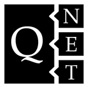

Welcome to QNET's documentation!
================================

.. image:: https://img.shields.io/badge/github-mabuchilab/QNET-blue.svg
   :alt: Source code on Github
   :target: https://github.com/mabuchilab/QNET
.. image:: https://img.shields.io/pypi/v/QNET.svg
   :alt: QNET on the Python Package Index
   :target: https://pypi.python.org/pypi/QNET
.. image:: https://badges.gitter.im/mabuchilab/QNET.svg
   :alt: Join the chat at https://gitter.im/mabuchilab/QNET
   :target: https://gitter.im/mabuchilab/QNET?utm_source=badge&utm_medium=badge&utm_campaign=pr-badge&utm_content=badge
.. image:: https://img.shields.io/travis/mabuchilab/QNET.svg
   :alt: Travis Continuous Integration
   :target: https://travis-ci.org/mabuchilab/QNET
.. image:: https://ci.appveyor.com/api/projects/status/x6sh1ko8eivt5xdh?svg=true
   :alt: Appveyor Continuous Integration
   :target: https://ci.appveyor.com/project/goerz/qnet
.. image:: https://img.shields.io/coveralls/github/mabuchilab/QNET/develop.svg
   :alt: Coveralls
   :target: https://coveralls.io/github/mabuchilab/QNET?branch=develop
.. image:: https://readthedocs.org/projects/qnet/badge/?version=latest
   :alt: Documentation Status
   :target: https://qnet.readthedocs.io/en/latest/?badge=latest
.. image:: https://img.shields.io/badge/License-MIT-green.svg
   :alt: MIT License
   :target: https://opensource.org/licenses/MIT

.. toctree::
   :maxdepth: 2
   :caption: Contents:

   readme
   contributing
   authors
   history
   library_structure
   symbolic_algebra
   circuit_rules
   printing

API
===

.. toctree::
   :maxdepth: 1

   API of the QNET package <API/qnet>
